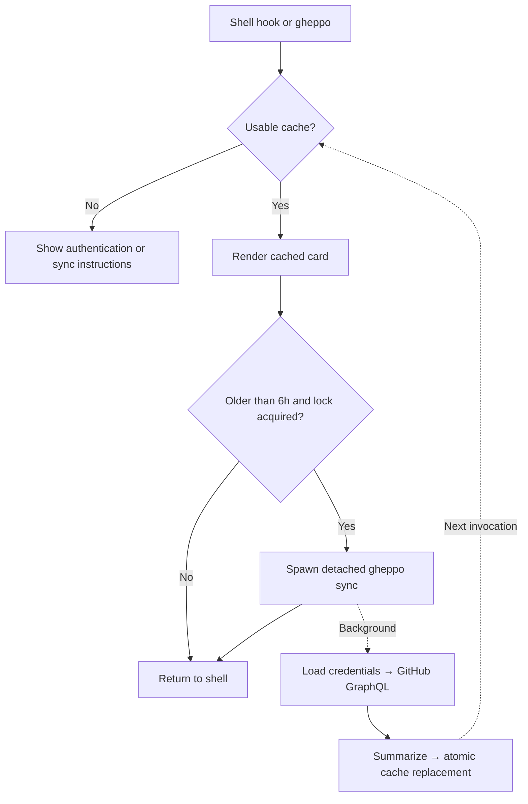

# Gheppo

> Your GitHub contribution graph, every time you open a terminal.

**Go 1.26.5+** · **[MIT License](LICENSE)**

Gheppo brings your GitHub contribution graph and activity statistics into your terminal. It renders cached data locally, then refreshes stale data in a detached process for a later invocation. Normal cached rendering does not wait for GitHub API requests.

---

## Highlights

- **Cache-first startup**: normal renders read only a local cache — no network wait at startup.
- **Background refresh**: a cross-process file lock gates detached refreshes when the cache is older than six hours. Cache updates use a temporary file and rename.
- **Keychain authentication**: `gheppo auth login` saves credentials in macOS Keychain, Linux Secret Service, or Windows Credential Manager via `go-keyring`.
- **Themes**: built-in `github` (default), `mono`, `catppuccin`, `nord`, `gruvbox`; switch with `gheppo theme`. Persisted to `config.json`, overridable via `GHEPPO_THEME`.
- **Responsive, animated rendering**: Bubble Tea + Lip Gloss TUI with progressive reveal; graceful degradation from 140+ columns down to 46, with a static fallback for non-TTY, `NO_COLOR`, `CI`, and dumb terminals.
- **Adaptive color modes**: automatic negotiation across TrueColor (24-bit), 256-color ANSI, and `NO_COLOR`-compliant ASCII.
- **Shell-safe integration**: Zsh (Powerlevel10k instant-prompt safe via a self-unregistering `line-init` widget) and Bash (`PROMPT_COMMAND` preservation).

---

## Architecture at a Glance

The GitHub path separates local rendering from network refresh:



The refresh lock is passed to the child process, which releases it on success or failure. If spawning fails, the parent releases it. Failed refreshes leave the previous cache available and do not fail the normal render command. Manual `gheppo sync` runs in the foreground.

Interactive rendering includes a reveal animation before the refresh check; cache-first does not imply a guaranteed sub-5 ms invocation. Set `GHEPPO_NO_ANIMATION=1` for static output.

See [ARCHITECTURE.md](ARCHITECTURE.md) for engineering background. [PROJECT.md](PROJECT.md) records the original project goals and handover; some implementation notes predate the current CLI and theme support.

---

## Quickstart

### 1. Installation

Clone and run the automated installer:

```bash
git clone https://github.com/dexisback/gheppo.git
cd gheppo
./scripts/install.sh
```

The installer builds the binary to `~/.local/bin/gheppo` and appends an idempotent, delimiter-marked shell integration block to your `.zshrc` or `.bashrc`. Ensure `~/.local/bin` is on your `$PATH`.

### 2. Authentication

Authenticate with a GitHub Personal Access Token that can read your profile and contribution data. For a classic token, use the `read:user` scope; fine-grained tokens use a different permission model.

```bash
gheppo auth login
```

The token is entered with terminal echo disabled, verified against the GitHub API, and stored in your OS keychain. When no keychain entry exists, the client also checks `GITHUB_TOKEN`, `GH_TOKEN`, and `GITHUB_MCP_TOKEN`; resolving an account from these variables requires a network request.

### 3. Initial Sync

Bootstrap the local contribution cache:

```bash
gheppo sync
```

Open a new terminal tab or window to see your card.

---

## Command Reference

| Command | Description |
| :--- | :--- |
| `gheppo` | Renders the cached card; spawns a detached refresh if the cache is >6h old. |
| `gheppo sync` | Fetches the calendar and profile stats from GitHub GraphQL and atomically updates the cache. |
| `gheppo theme` | Opens an interactive theme selector (arrow keys / enter / q). |
| `gheppo theme <name>` | Switches directly to a named theme. |
| `gheppo auth login` | Prompts for a GitHub PAT, verifies it, and stores it in the OS keychain. |
| `gheppo auth status` | Shows the authenticated account. |
| `gheppo auth logout` | Removes credentials from the keychain. |
| `gheppo uninstall` | Removes the binary, shell integration block, and stored credentials. |
| `gheppo --version` | Prints the current version. |

---

## Themes

Five built-in themes: `github` (default), `mono`, `catppuccin`, `nord`, `gruvbox`.

```bash
gheppo theme
gheppo theme catppuccin
```

The choice persists to `<user config dir>/gheppo/config.json` and takes effect on the next render. `GHEPPO_THEME` overrides it per-session; a missing or corrupt config falls back to `github`.

---

## Shell Integration

- **Zsh**: a self-deregistering `zle-line-init` widget runs Gheppo after the prompt is ready, avoiding Powerlevel10k instant-prompt warnings and redrawing cleanly with `zle -I`.
- **Bash**: wraps `PROMPT_COMMAND` (string and array forms) and restores the user's original commands after the first run.

Managed blocks are delimited by:

```bash
# >>> gheppo >>>
...
# <<< gheppo <<<
```

---

## Terminal Font

Gheppo is designed around **Iosevka Term**: compact terminal proportions, high density, and strong glyph alignment for contribution cells and statistics. It works with any monospace font, but the layout is tuned to Iosevka Term's metrics.

Download: [Iosevka](https://github.com/be5invis/Iosevka)

---

## Terminal Color Modes

1. **`NO_COLOR` set**: ASCII output with no escape codes.
2. **`COLORTERM=truecolor|24bit`**: full 24-bit rendering with the theme's palette.
3. **`TERM=*256color*`**: 256-color approximation.
4. **Otherwise**: ASCII fallback.

Reveal animation is skipped automatically on non-TTY, `CI`, dumb terminals, or when `GHEPPO_NO_ANIMATION` is set.

---

## Development & Verification

### Prerequisites

- Go 1.26.5 or newer, as required by `go.mod`.
- The installer configures Bash or Zsh on Linux/macOS; it does not configure PowerShell or Fish.
- An accessible OS keychain. Linux requires a running Secret Service provider, such as GNOME Keyring.

### Test Suite

```bash
# Unit and integration tests
go test ./...

# Concurrency and race safety
go test -race ./...

# Cross-compilation checks
GOOS=linux GOARCH=amd64 go build ./...
GOOS=darwin GOARCH=arm64 go build ./...
GOOS=windows GOARCH=amd64 go build ./...
```

---

## License

MIT © [Gheppo Authors](LICENSE)
