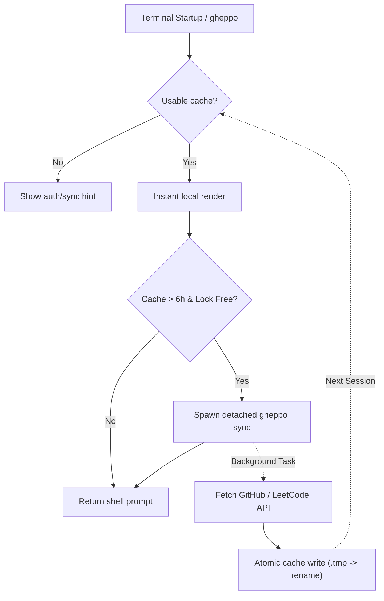

# Gheppo

> Your GitHub & LeetCode contribution graphs, every time you open a terminal.

[](https://golang.org)
[](https://github.com/dexisback/gheppo/releases)
[](LICENSE)

Gheppo brings your contribution graphs, streaks, and activity statistics straight into your terminal whenever a new shell session opens. It renders instantly using a local cache, then asynchronously refreshes stale data in the background without blocking your shell prompt.

---

## Highlights

- ⚡ **Instant, Cache-First Startup**: Renders from a local cache in sub-5ms—no waiting on remote network calls when opening a terminal.
- 🔄 **Non-Blocking Background Refresh**: Automatically spawns a detached background sync when the cache is older than 6 hours, guarded by cross-process file locking.
- 🐙 **GitHub & 💡 LeetCode Sources**: Switch seamlessly between GitHub (contributions, stars, repos, followers) and LeetCode (problems solved by difficulty, contest ranking, streaks).
- 🎨 **5 Polished Themes**: Built-in `github` (default), `mono`, `catppuccin`, `nord`, and `gruvbox` palettes with balanced contrast for empty and active cells.
- 🔒 **Secure Keychain Storage**: Tokens and credentials are encrypted in your OS keychain (macOS Keychain, Linux Secret Service, Windows Credential Manager).
- 🛡️ **Security-Hardened**: Strict ANSI/control code sanitization on remote data, bounded HTTP streams, atomic file writes, and SHA-256 verified releases.
- 🐚 **Shell-Safe Integration**: Supports Zsh (Powerlevel10k instant-prompt safe via a self-unregistering `line-init` hook) and Bash (safe `PROMPT_COMMAND` chaining).
- 📐 **Responsive Terminal Layout**: Dynamic scaling from 140+ columns down to 46 columns, with automatic TrueColor, 256-color, and `NO_COLOR` fallbacks.

---

## Installation Guide

### Quick Install (macOS & Linux)

Install the latest release with a single command:

```bash
curl -fsSL https://raw.githubusercontent.com/dexisback/gheppo/main/scripts/install.sh | sh
```

*Or using `wget`:*

```bash
wget -qO- https://raw.githubusercontent.com/dexisback/gheppo/main/scripts/install.sh | sh
```

The installer will:
1. Detect your OS (`Linux`, `Darwin/macOS`) and architecture (`x86_64/amd64`, `arm64`).
2. Download the official release archive and verify its SHA-256 checksum.
3. Install the `gheppo` binary into `~/.local/bin` (or `$GHEPPO_INSTALL_DIR`).
4. Automatically append the idempotent shell integration hook to your `~/.zshrc` or `~/.bashrc`.

---

### Platform-Specific Instructions

#### 🍎 macOS (Apple Silicon & Intel)
The quick installer automatically selects the correct universal binary (`darwin_arm64` or `darwin_amd64`) and uses macOS Keychain for credential storage.

Ensure `~/.local/bin` is in your `$PATH` (in `~/.zshrc` or `~/.bashrc`):
```bash
export PATH="$HOME/.local/bin:$PATH"
```

#### 🐧 Linux (Ubuntu, Debian, Fedora, Arch, etc.)
The installer supports `linux_amd64` and `linux_arm64`.

> **Note on Keyring:** Gheppo stores authentication credentials via the standard Linux Secret Service API (e.g. GNOME Keyring, KWallet, KeePassXC). If running in a headless or minimal environment without a Secret Service daemon, you can export `GITHUB_TOKEN` in your shell environment.

#### 🪟 Windows
- **WSL / Git Bash / MSYS2**: Run the quick install `curl` command inside your Linux or Bash environment.
- **Manual Binary Install (PowerShell / Command Prompt)**:
  1. Download the latest `gheppo_<version>_windows_amd64.zip` from [GitHub Releases](https://github.com/dexisback/gheppo/releases).
  2. Extract `gheppo.exe` to a folder in your `%PATH%` (e.g. `C:\Program Files\gheppo\` or `C:\Users\<User>\bin`).
  3. Credentials will be securely stored in Windows Credential Manager.

#### 🛠️ Custom Install Options
You can customize the version or destination directory via environment variables:

```bash
GHEPPO_VERSION=v0.1.0 GHEPPO_INSTALL_DIR=/usr/local/bin curl -fsSL https://raw.githubusercontent.com/dexisback/gheppo/main/scripts/install.sh | sh
```

#### 🔨 Build from Source (Requires Go 1.26+)
```bash
git clone https://github.com/dexisback/gheppo.git
cd gheppo
go build -o ~/.local/bin/gheppo .
```

---

## Quickstart

### 1. Authenticate

Run the interactive login command:

```bash
gheppo auth login
```

Choose your primary data source:
- **GitHub**: Paste a GitHub Personal Access Token (classic token with `read:user` scope, or fine-grained). Input is masked in the terminal.
- **LeetCode**: Enter your LeetCode username (public profiles require no token).

### 2. Initial Sync & Render

Sync your activity data immediately:

```bash
gheppo sync
```

Open a new terminal window or tab to see your animated contribution card!

---

## Data Sources

Gheppo supports multiple activity sources. You can switch between them at any time:

### Interactive Selector
```bash
gheppo source
```

### Direct CLI Switching
```bash
# Switch to GitHub
gheppo source github

# Switch to LeetCode
gheppo source leetcode <username>
```

| Source | Displayed Metrics |
| :--- | :--- |
| **GitHub** | 52-week contribution calendar, YTD contributions, active/longest streak, daily average, total stars, repositories, followers, following. |
| **LeetCode** | 52-week submission calendar, problems solved (Easy / Medium / Hard breakdown), contest rating, global ranking, reputation, streaks. |

---

## Themes

Gheppo features 5 built-in color schemes with theme-aware empty cell contrast:

```bash
# Open interactive theme selector
gheppo theme

# Or switch directly
gheppo theme catppuccin
```

| Theme | Description |
| :--- | :--- |
| `github` | Classic GitHub green palette *(default)* |
| `mono` | High-contrast monochromatic grayscale |
| `catppuccin` | Catppuccin Mocha pastel palette |
| `nord` | Arctic, north-bluish clean tones |
| `gruvbox` | Warm retro groove palette |

Themes are saved to `~/.config/gheppo/config.json` and can be overridden per session with `export GHEPPO_THEME=nord`.

---

## Command Reference

```
Gheppo CLI - Terminal Contribution Dashboard

Usage:
  gheppo [command]

Available Commands:
  gheppo                        Render the contribution card (default)
  gheppo sync                   Fetch fresh data from active source and update cache
  gheppo source [name] [user]   View, interactively pick, or switch data source
  gheppo theme [name]           View, interactively pick, or switch theme
  gheppo auth login             Interactive login & setup
  gheppo auth status            Check current source and authentication status
  gheppo auth logout            Clear credentials/username for active source
  gheppo uninstall              Remove binary, config, cache, and shell integration
  gheppo --version              Display Gheppo version
```

---

## Environment Variables

| Variable | Description |
| :--- | :--- |
| `GHEPPO_THEME` | Override active theme (`github`, `mono`, `catppuccin`, `nord`, `gruvbox`) |
| `GHEPPO_NO_ANIMATION=1` | Disable progressive reveal animation and render statically |
| `GITHUB_TOKEN` / `GH_TOKEN` | Fallback GitHub token if not present in OS keychain |
| `NO_COLOR=1` | Enforce plain ASCII output with ANSI codes disabled |

---

## Architecture



For in-depth architectural details and technical design notes, see [ARCHITECTURE.md](ARCHITECTURE.md).

---

## Uninstallation

To cleanly remove Gheppo, its shell integration hooks, cache, and credentials:

```bash
gheppo uninstall
```

---

## License

MIT © [Gheppo Authors](LICENSE)
