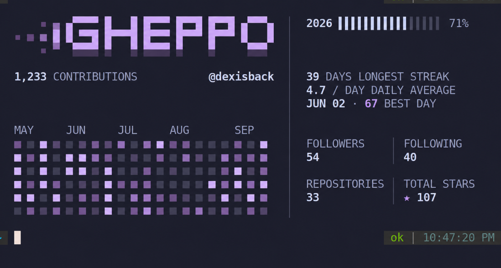

```text
   _____ _                               
  / ____| |                              
 | |  __| |__   ___ _ __  _ __   ___     
 | | |_ | '_ \ / _ \ '_ \| '_ \ / _ \    
 | |__| | | | |  __/ |_) | |_) | (_) |   
  \_____|_| |_|\___| .__/| .__/ \___/    
                   | |   | |             
                   |_|   |_|             
```

> Your GitHub & LeetCode contribution graphs, every time you open a terminal.

<p align="center">
  
</p>

<p align="center">
  <a href="https://golang.org"></a>
  <a href="https://github.com/dexisback/gheppo/releases"></a>
  <a href="LICENSE"></a>
</p>

Gheppo brings your contribution graphs, activity streaks, and profile statistics into your terminal. It renders cached data locally for instant startup, then refreshes stale data in a detached background process. Normal rendering never blocks on remote API requests.

---

## Highlights

- **Cache-first startup**: Normal renders read strictly from local cache files—no network delay when opening a shell.
- **Background refresh**: A cross-process file lock gates detached background refreshes when cache age exceeds six hours. Cache updates use atomic temporary file replacement.
- **Multi-source support**: Seamlessly switch between GitHub (contributions, stars, repositories, followers) and LeetCode (problems solved, difficulty breakdown, contest ranking, streaks).
- **Keychain authentication**: `gheppo auth login` securely stores tokens in macOS Keychain, Linux Secret Service, or Windows Credential Manager via `go-keyring`.
- **Themes**: Built-in `github` (default), `mono`, `catppuccin`, `nord`, and `gruvbox` palettes with balanced contrast for empty and active cells.
- **Responsive rendering**: Bubble Tea + Lip Gloss TUI with progressive reveal; scales smoothly from 140+ columns down to 46, with static fallbacks for non-TTY, `NO_COLOR`, `CI`, and dumb terminals.
- **Adaptive color modes**: Automatic negotiation across TrueColor (24-bit), 256-color ANSI, and `NO_COLOR`-compliant ASCII.
- **Shell-safe integration**: Zsh (Powerlevel10k instant-prompt safe via a self-unregistering `line-init` widget) and Bash (`PROMPT_COMMAND` preservation).
- **Security hardened**: Remote input and API response sanitization (ANSI and control code stripping), bounded HTTP response decoding, atomic filesystem writes, and SHA-256 verified binary releases.

---

## Architecture at a Glance

The rendering path strictly isolates local presentation from network synchronization:


The refresh lock is acquired by the parent and passed to the child process, which releases it upon completion. If spawning fails, the parent releases the lock immediately. Stale caches remain usable during network errors and do not interrupt standard terminal startup.

Interactive rendering includes an optional reveal animation before the refresh check. Set `GHEPPO_NO_ANIMATION=1` for static output.

See [ARCHITECTURE.md](ARCHITECTURE.md) for engineering design details.

---

## Installation

### Remote Installer (macOS & Linux)

Install the latest release binary:

```bash
curl -fsSL https://raw.githubusercontent.com/dexisback/gheppo/main/scripts/install.sh | sh
```

Or using `wget`:

```bash
wget -qO- https://raw.githubusercontent.com/dexisback/gheppo/main/scripts/install.sh | sh
```

The script automatically:
1. Detects OS (`Linux`, `Darwin`) and CPU architecture (`x86_64/amd64`, `arm64`).
2. Downloads the official release archive and verifies its SHA-256 checksum from `checksums.txt`.
3. Installs the executable to `~/.local/bin/gheppo` (or `$GHEPPO_INSTALL_DIR`).
4. Configures shell integration in `~/.zshrc` or `~/.bashrc`.

Ensure `~/.local/bin` is in your `$PATH`:

```bash
export PATH="$HOME/.local/bin:$PATH"
```

---

### Platform-Specific Details

#### macOS (Apple Silicon & Intel)
The installer selects the matching Darwin binary (`arm64` or `amd64`) and uses macOS Keychain for credential storage.

#### Linux
Binaries are provided for `linux_amd64` and `linux_arm64`. Credentials are stored via the Linux Secret Service API (e.g. GNOME Keyring, KWallet, KeePassXC). On headless systems without a Secret Service daemon, export `GITHUB_TOKEN` in your shell profile.

#### Windows
- **WSL / MSYS2 / Git Bash**: Run the remote curl installer directly.
- **Manual Binary**: Download `gheppo_<version>_windows_amd64.zip` from [GitHub Releases](https://github.com/dexisback/gheppo/releases), extract `gheppo.exe` into a directory on your `%PATH%`. Credentials are stored in Windows Credential Manager.

#### Custom Installer Options
Override release version or installation target directory via environment variables:

```bash
GHEPPO_VERSION=v0.1.0 GHEPPO_INSTALL_DIR=/usr/local/bin curl -fsSL https://raw.githubusercontent.com/dexisback/gheppo/main/scripts/install.sh | sh
```

#### Build from Source
Requires Go 1.26 or newer:

```bash
git clone https://github.com/dexisback/gheppo.git
cd gheppo
go build -o ~/.local/bin/gheppo .
```

---

## Quickstart

### 1. Authentication

Run interactive authentication:

```bash
gheppo auth login
```

Select your data source:
- **GitHub**: Prompts for a GitHub Personal Access Token (classic token with `read:user` scope, or fine-grained). Input is entered with terminal echo disabled, validated against GitHub API, and stored in the OS keychain.
- **LeetCode**: Prompts for your LeetCode username (public profiles do not require tokens).

### 2. Initial Sync

Fetch your initial contribution data:

```bash
gheppo sync
```

Open a new terminal tab or window to view your card.

---

## Data Sources

Switch between sources interactively or via CLI flags:

```bash
# Interactive selector
gheppo source

# Direct switch
gheppo source github
gheppo source leetcode <username>
```

| Source | Displayed Metrics |
| :--- | :--- |
| **GitHub** | 52-week contribution calendar, YTD contributions, active streak, longest streak, daily average, total stars, repositories, followers, following. |
| **LeetCode** | 52-week submission calendar, total problems solved, difficulty breakdown (Easy / Medium / Hard), contest rating, global ranking, reputation, active streak. |

---

## Themes

Five built-in palettes are supported: `github` (default), `mono`, `catppuccin`, `nord`, `gruvbox`.

```bash
# Interactive theme selector
gheppo theme

# Direct switch
gheppo theme catppuccin
```

Selection is persisted to `<user config dir>/gheppo/config.json`. `GHEPPO_THEME` overrides the configuration per-session.

---

## Command Reference

| Command | Description |
| :--- | :--- |
| `gheppo` | Renders the cached card; spawns a detached refresh if the cache is >6h old. |
| `gheppo sync` | Fetches fresh data from the active source and updates the local cache. |
| `gheppo source` | Opens the interactive source selector (`github`, `leetcode`). |
| `gheppo source <name> [user]` | Switches data source directly (`github` or `leetcode <username>`). |
| `gheppo theme` | Opens the interactive theme selector (arrow keys / enter / q). |
| `gheppo theme <name>` | Switches directly to a named theme. |
| `gheppo auth login` | Interactive source selector & login (GitHub PAT or LeetCode username) + initial sync. |
| `gheppo auth status` | Displays current source and credential status. |
| `gheppo auth logout` | Clears stored credentials or configured username for the active source. |
| `gheppo uninstall` | Removes binary, configuration, cache, and shell integration blocks. |
| `gheppo --version` | Prints the version and build metadata. |

---

## Environment Variables

| Variable | Description |
| :--- | :--- |
| `GHEPPO_THEME` | Override theme (`github`, `mono`, `catppuccin`, `nord`, `gruvbox`). |
| `GHEPPO_NO_ANIMATION=1` | Disable reveal animations and render statically. |
| `GITHUB_TOKEN` / `GH_TOKEN` | Fallback GitHub token if not present in OS keychain. |
| `NO_COLOR=1` | Enforce plain ASCII output with ANSI codes disabled. |

---

## Shell Integration

- **Zsh**: A self-deregistering `zle-line-init` widget executes Gheppo once the prompt is initialized, preventing Powerlevel10k instant-prompt warnings and redrawing cleanly with `zle -I`.
- **Bash**: Wraps `PROMPT_COMMAND` (string and array forms) and restores original commands after the first execution.

Managed blocks are delimited by:

```bash
# >>> gheppo >>>
...
# <<< gheppo <<<
```

---

## Terminal Font & Color Modes

Gheppo is designed around **Iosevka Term**: compact proportions, high density, and strong glyph alignment for calendar cells and statistics. It functions with any monospace font.

### Color Modes

1. **`NO_COLOR` set**: Plain ASCII output with escape codes stripped.
2. **`COLORTERM=truecolor|24bit`**: Full 24-bit TrueColor rendering.
3. **`TERM=*256color*`**: 256-color palette approximation.
4. **Otherwise**: Fallback ASCII.

---

## Development & Verification

### Test Suite

```bash
# Unit and integration tests
go test ./...

# Concurrency and race safety
go test -race ./...

# Cross-compilation checks
GOOS=linux GOARCH=amd64 go build ./...
GOOS=darwin GOARCH=arm64 go build ./...
GOOS=windows GOARCH=amd64 go build ./...
```

---

## Uninstallation

To remove the binary, shell integration, configuration, and cache files:

```bash
gheppo uninstall
```

---

## License

MIT © [Gheppo Authors](LICENSE)
