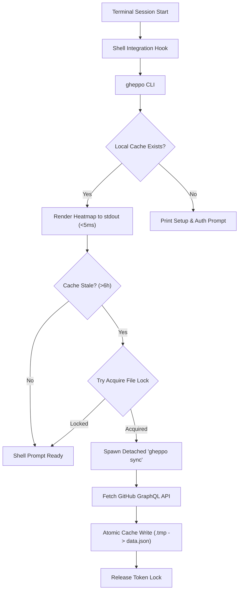

# Gheppo

> Ambient GitHub contribution heatmap for every terminal session.

[](https://golang.org)
[](LICENSE)
[]()

Gheppo brings your GitHub contribution graph directly into your terminal startup. Designed with a strict **performance-first invariant**, it displays your activity graph in under 5 milliseconds from a local cache without blocking shell startup or waiting on network roundtrips.

---

## Highlights

- **Sub-Millisecond Startup Path**: Zero network I/O on terminal launch. Cache-first rendering guarantees instant output (<5ms).
- **Non-Blocking Background Refresh**: Asynchronous cache updates via detached background processes protected by cross-process locks.
- **Secure Credential Management**: Tokens are stored exclusively in native OS keychains (macOS Keychain, Linux Secret Service, Windows Credential Manager) via `go-keyring`.
- **Zero Shell Hiccups**: Fully compatible with Zsh (including Powerlevel10k instant prompt) and Bash (`PROMPT_COMMAND` preservation).
- **Adaptive Terminal Rendering**: Automatic capability detection across TrueColor (24-bit), 256-color ANSI, and `NO_COLOR`-compliant ASCII.

---

## Architecture at a Glance



For comprehensive engineering specifications, lock safety, and streak calculation internals, see [ARCHITECTURE.md](ARCHITECTURE.md).

---

## Quickstart

### 1. Installation

Clone and run the automated installer:

```bash
git clone https://github.com/dexisback/gheppo.git
cd gheppo
./scripts/install.sh
```

The installer builds the binary to `~/.local/bin/gheppo` and adds an idempotent shell integration block to your `.zshrc` or `.bashrc`.

> Ensure `~/.local/bin` is in your `$PATH`.

### 2. Authentication

Authenticate using a GitHub Personal Access Token (classic or fine-grained) with `read:user` permission:

```bash
gheppo auth login
```

The token is verified against the GitHub API and stored in your operating system keychain.

### 3. Initial Sync

Bootstrap your local contribution cache:

```bash
gheppo sync
```

Open a new terminal tab or window to view your ambient heatmap.

---

## Command Reference

| Command | Description |
| :--- | :--- |
| `gheppo` | Renders cached heatmap and triggers detached refresh if cache is older than 6h. |
| `gheppo sync` | Fetches fresh calendar from GitHub GraphQL API and atomically updates local cache. |
| `gheppo auth login` | Interactively prompts for a GitHub PAT, verifies credentials, and saves to keychain. |
| `gheppo auth status` | Displays the currently authenticated GitHub account. |
| `gheppo auth logout` | Removes credentials from the OS keychain. |
| `gheppo uninstall` | Removes the binary, shell configuration blocks, and stored keychain secrets. |
| `gheppo --version` | Prints current version. |

---

## Shell Integration

Gheppo hooks into shell startup without introducing prompt latency or display glitches.

- **Zsh**: Uses a self-unregistering line-init widget hook (`add-zle-hook-widget line-init _gheppo_once`) so execution occurs after the prompt is ready, preventing Powerlevel10k instant prompt warnings.
- **Bash**: Safely wraps `PROMPT_COMMAND` (supporting both string and array formats) and restores original user commands after initial execution.

Shell hooks are demarcated by managed comment delimiters:
```bash
# >>> gheppo >>>
...
# <<< gheppo <<<
```

---

## Terminal Font

For optimal visual quality, Gheppo is designed around **Iosevka Term**.

Iosevka Term provides:
- Compact terminal-oriented proportions
- High information density
- Distinctive glyphs with strong alignment
- Excellent rendering of contribution cells and statistics

While Gheppo works with any monospace font, the UI is optimized for Iosevka Term's metrics.

Download: [Iosevka](https://github.com/be5invis/Iosevka)

---

## Terminal Color Modes

Gheppo automatically negotiates terminal color support:

1. **`NO_COLOR` set**: Standard ASCII output (`.` `-` `=` `+` `#` intensity glyphs, zero color codes).
2. **`COLORTERM=truecolor` / `24bit`**: Full 24-bit TrueColor rendering with design-specified GitHub green palette.
3. **`TERM=*256color*`**: 256-color ANSI palette approximation.
4. **Basic terminal**: ASCII fallback with intensity-based glyphs.

---

## Development & Verification

### Prerequisites

- Go 1.22+
- Cgo-free build pipeline (native system keychain bindings)

### Test Suite & Concurrency Verification

```bash
# Run all unit and integration tests
go test -v ./...

# Validate cross-process concurrency and race safety
go test -race ./...

# Cross-compilation checks
GOOS=linux GOARCH=amd64 go build ./...
GOOS=darwin GOARCH=arm64 go build ./...
GOOS=windows GOARCH=amd64 go build ./...
```

---

## License

MIT © [Gheppo Authors](LICENSE)
